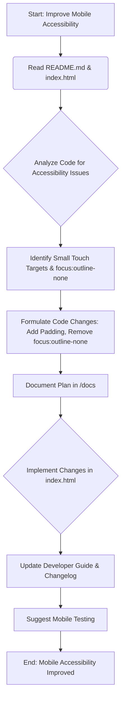

# Mobile Accessibility Improvement Plan

**Goal:** Enhance the user experience on mobile devices by ensuring sufficient touch target sizes, readable text, and proper focus indicators for the IdeaFlow web application.

**Current State:**
The application uses React and Tailwind CSS. Initial analysis of `index.html` shows that the necessary viewport meta tag is present, and Tailwind CSS is being used for styling.

**Identified Accessibility Issues:**
*   **Small Touch Targets:** The edit (&#9998;) and delete (&#10060;) buttons within the `ProjectCard` component currently have small default touch areas, making them difficult to accurately tap on mobile devices.
*   **Missing Focus Indicators:** The `focus:outline-none` class is used on some buttons, which removes the visual outline when the element is focused via keyboard navigation. This is detrimental to users who rely on keyboard navigation.
*   **Potential Spacing/Font Size:** While Tailwind provides responsive utilities, a review of overall spacing and font sizes is needed to ensure optimal readability and usability on smaller screens after initial changes.

**Implementation Plan:**

1.  **Analyze Existing Code:** (Completed) - Reviewed `index.html` to understand the current structure and styling.
2.  **Identify Specific Accessibility Issues:** (Completed) - Pinpointed small touch targets and the use of `focus:outline-none`.
3.  **Formulate Code Changes:**
    *   Increase the touch target size for the edit and delete buttons in the `ProjectCard` by adding padding classes (e.g., `p-2`).
    *   Remove the `focus:outline-none` class from buttons to restore default focus indicators, improving keyboard accessibility.
    *   (Potential future step) Evaluate and adjust font sizes and spacing using responsive Tailwind classes if necessary after initial changes are implemented and tested.
4.  **Document the Plan:** (This step) - Create this markdown file detailing the plan.
5.  **Implement Changes:** Apply the formulated code changes to the `index.html` file.
6.  **Update Documentation:** Update the `/docs/Developer Guide.md` and `/docs/Changelog.md` to reflect the implemented changes.
7.  **Suggest Testing:** Recommend testing the mobile accessibility improvements on various mobile devices or using browser developer tools to verify the improvements.

**Mermaid Diagram of the Plan:**



**Proposed Code Changes:**

*   **For the Edit Button in `ProjectCard` (around line 96 in the provided `index.html` content):**
    *   **Search:**
        ```html
        className="text-green-500 hover:text-green-700 focus:outline-none text-2xl"
        ```
    *   **Replace:**
        ```html
        className="text-green-500 hover:text-green-700 text-2xl p-2"
        ```

*   **For the Delete Button in `ProjectCard` (around line 271 in the provided `index.html` content):**
    *   **Search:**
        ```html
        className="text-red-500 hover:text-red-700 focus:outline-none mt-2"
        ```
    *   **Replace:**
        ```html
        className="text-red-500 hover:text-red-700 mt-2 p-2"
        ```

This document outlines the approach to enhance mobile accessibility.